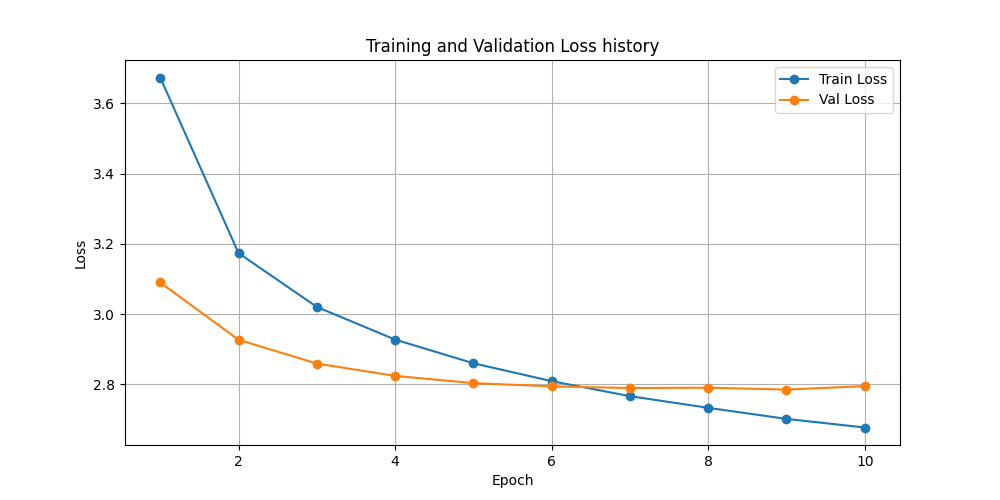

# ✨ Show Attend and Tell: Neural Image Captioning 📸

[](https://www.python.org/)
[](https://pytorch.org/)
[](https://flask.palletsprojects.com/)
[](https://opensource.org/licenses/MIT)
[](#device-compatibility)

A Deep learning Project that generates natural language descriptions for images. This project implements two advanced architectures—**Show & Tell** (CNN-LSTM) and **Show, Attend & Tell** (CNN-LSTM with Bahdanau Visual Attention)—trained on the **Flickr8k** and **Flickr30k** datasets. It includes an interactive web interface for real-time model inference and training diagnostics.

---

## 📽️ Application Walkthrough

Experience the platform in action! The recording below demonstrates the interactive web application, showcasing real-time image uploads, decoding configuration (beam width adjustments), caption generation (Greedy vs. Beam Search), vocabulary exploration, and dynamic training history visualizations.

<div align="center">
  <video src="https://github.com/user-attachments/assets/131f76ef-8d97-4db2-813f-6d3d2f1a7e6e" width="90%" controls autoplay loop muted style="border-radius: 15px; border: 1px solid rgba(255,255,255,0.1); box-shadow: 0 10px 30px rgba(0,0,0,0.5);"></video>
</div>

---

## 🌟 Key Features

* **Dual Model Architectures**: Choose between a standard encoder-decoder CNN-LSTM model and an attention-based unrolled LSTM-Cell model.
* **Visual Attention Module**: Implements Bahdanau (Additive) Attention to dynamically align words to specific spatial regions of the image during generation.
* **Decoding Strategies**: Real-time generation using both **Greedy Search** and **Beam Search** with adjustable beam widths.
* **Flexible Dataset Support**: Out-of-the-box support for both **Flickr8k** and **Flickr30k** datasets.
* **Robust Demo Mode**: Generates colored dummy datasets with 150 programmatic images so you can verify the entire training-to-inference pipeline locally within seconds without downloading massive zip archives.
* **Stunning Web Dashboard**: A glassmorphic frontend utilizing Outfit and Plus Jakarta Sans typography, featuring:
  * **Caption Generator**: Drag-and-drop uploads, parameter sliders, and animated results cards.
  * **Training Diagnostics**: Interactive loss charts powered by Chart.js.
  * **Vocabulary Explorer**: Real-time searchable glossary showing word-to-token mappings.
* **Multi-Device Support**: Optimized for NVIDIA GPUs (**CUDA**), Apple Silicon (**MPS**), and **CPU** fallbacks.

---

## 🏗️ Model Architectures

The platform supports two distinct deep learning architectures for image captioning:

### 1. Show & Tell (Vanilla CNN-LSTM)
* **Encoder**: Pre-trained ResNet-50 (with convolutional weights frozen) extracts a 2048-dimensional feature vector, projected to `embed_size` via a Linear Layer + Batch Normalization.
* **Decoder**: A standard PyTorch LSTM. The image embedding is concatenated as the very first token in the sequence step, followed by word embeddings.

### 2. Show, Attend & Tell (Visual Attention)
* **Encoder**: ResNet-50 backbone mapped to a spatial grid of size $14 \times 14 \times 2048$ representing spatial feature regions.
* **Attention Mechanism**: Implements Bahdanau Additive Attention to score and weigh spatial pixels relative to the decoder's current hidden state.
* **Decoder**: An unrolled PyTorch `LSTMCell` that ingests a concatenated vector of the current word embedding and the weighted context vector at each time step.

---

## 📁 Repository Structure

```directory
.
├── src/
│   ├── dataset.py        # Flickr8k & Flickr30k PyTorch Datasets & DataLoaders
│   ├── model.py          # Model declarations (ShowAndTell, ShowAttendAndTell)
│   ├── inference.py      # Greedy and Beam Search decoding strategies
│   └── __init__.py
├── templates/
│   └── index.html        # Interactive Flask dashboard (HTML5 + CSS + JS)
├── static/
│   └── js/
│       └── main.js       # AJAX handlers, Chart.js logic & event handlers
├── checkpoints/          # Saved model states (best.pth, latest.pth)
├── data/                 # Dataset folder (downloaded or generated programmatically)
├── download_data.py      # Automated Flickr8k downloader and demo generator
├── train.py              # Model training loop and loss history plotting
├── evaluate.py           # BLEU (1-4) score validation suite
├── server.py             # Flask Web Server
├── run.sh                # Executable script to spin up the web app
├── vocab.json            # Generated vocabulary dictionary
├── loss_plot.png         # Saved training loss curves
└── workflow.ipynb        # Complete notebook for Kaggle/Colab runthroughs
```

---

## 🚀 Getting Started

### 📋 Prerequisites & Installation
Ensure you have Python 3.11+ installed. Clone the repository and install the required packages:

```bash
# Clone the repository
git clone https://github.com/Abdullah1Allnami/Image-Caption.git
cd Image-Caption

# Create and activate a virtual environment (Optional but Recommended)
conda create -n caption_env python=3.11 -y
conda activate caption_env

# Install dependencies
pip install torch torchvision nltk matplotlib tqdm pandas Flask pillow
```

Ensure NLTK's tokenizer models are downloaded:
```bash
python -c "import nltk; nltk.download('punkt')"
```

---

## 🛠️ Data Preparation

You can set up the dataset in one of two modes:

### A. Demo Mode (Generates 150 Dummy Images in Seconds)
Ideal for local testing, debugging, and spinning up the server quickly without downloading large files.
```bash
python download_data.py --demo
```
This script downloads only the caption files, parses the first 150 images, and creates colorful dummy `.jpg` files locally under `data/Flicker8k_Dataset/`.

### B. Full Flickr8k Mode (Downloads ~1GB)
Downloads the entire Flickr8k dataset (captions & images) and extracts it to the correct path:
```bash
python download_data.py
```

---

## 🏋️ Training the Model

Run the training script to build the vocabulary and train the network. By default, it trains the **Attention Model (Show, Attend & Tell)** on the prepared data.

```bash
python train.py
```

* Hyperparameters such as `num_epochs=10`, `batch_size=32`, `learning_rate=1e-3`, `hidden_size=512`, and `embed_size=256` are configured in `train.py`.
* Models are saved dynamically inside the `checkpoints/` directory:
  * `latest.pth` is updated at the end of every epoch.
  * `best.pth` is updated whenever validation loss reaches a new minimum.

### 📈 Training Loss Plot
Upon training completion, the loss curves are automatically saved as `loss_plot.png` in the project root:

<div align="center">
  
</div>

---

## 📊 Evaluation & Metrics

The project uses the standard **BLEU (Bilingual Evaluation Understudy)** metric to evaluate generated captions against five reference ground truth captions on the test set.

To run the evaluation suite:
```bash
python evaluate.py
```

### 🏆 Test Results (Flickr8k test split)
Below are the BLEU scores obtained by our pre-trained model:

| Decoding Strategy | BLEU-1 | BLEU-2 | BLEU-3 | BLEU-4 |
| :--- | :---: | :---: | :---: | :---: |
| **Greedy Search** | 47.26% | 17.88% | 6.61% | 0.00% |
| **Beam Search (Width=3)** | **46.55%** | **20.83%** | **10.78%** | **5.43%** |

> [!NOTE]
> Beam Search achieves significantly stronger BLEU-3 and BLEU-4 scores by exploring multiple candidate paths, avoiding the local-optima pitfalls of greedy selection.

---

## 🖥️ Running the Web App

Launch the interactive Flask web dashboard to generate captions via your browser:

```bash
# Set execute permissions and run the startup script
chmod +x run.sh
./run.sh
```
Or run directly via python:
```bash
python server.py
```

Open your browser and navigate to **`http://127.0.0.1:5004`**.

---

## 🔮 Command-Line Inference

You can also run inference on individual custom images from the terminal:

```bash
python src/inference.py --image path/to/your/image.jpg --checkpoint checkpoints/best.pth --vocab vocab.json --beam 3
```

---

## 🛠️ Built With

* **Deep Learning Framework**: [PyTorch](https://pytorch.org/) & [torchvision](https://pytorch.org/vision/stable/index.html)
* **Natural Language Processing**: [NLTK](https://www.nltk.org/)
* **Web Backend**: [Flask (Python)](https://flask.palletsprojects.com/)
* **Web Frontend**: Vanilla HTML5, Modern CSS (Variable styling, Blur-filters, animations) & JavaScript (AJAX, DOM manipulation)
* **Diagnostics Visualizations**: [Chart.js](https://www.chartjs.org/) & [Matplotlib](https://matplotlib.org/)

---

## 📜 License
This project is licensed under the MIT License - see the [LICENSE](LICENSE) file for details.
